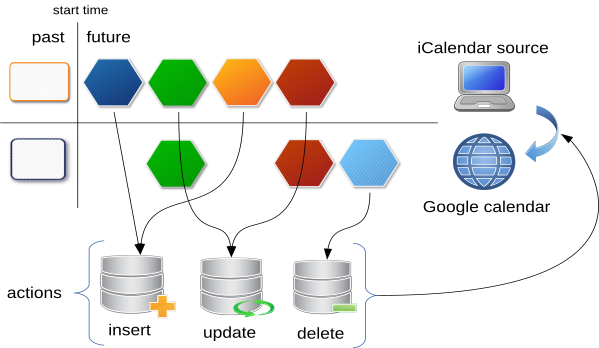

# sync_ics2gcal

[](https://badge.fury.io/py/sync-ics2gcal)
[](https://travis-ci.org/b4tman/sync_ics2gcal)
[](https://dependabot.com)
[](https://app.fossa.io/projects/git%2Bgithub.com%2Fb4tman%2Fsync_ics2gcal?ref=badge_shield)


Python scripts for sync .ics file with Google calendar

## Installation

To install from [PyPI](https://pypi.org/project/sync-ics2gcal/) with [pip](https://pypi.python.org/pypi/pip), run:

```
pip install sync-ics2gcal
```


Or download source code and install:

```
python setup.py install
```

## Configuration

### Create application in Google API Console
1. Create a new project: https://console.developers.google.com/project
2. Choose the new project from the top right project dropdown (only if another project is selected)
3. In the project Dashboard, choose "Library"
4. Find and Enable "Google Calendar API"
5. In the project Dashboard, choose "Credentials"
6. In the "Service Accounts" group, click to "Manage service accounts"
7. Click "Create service account"
8. Choose service account name and ID
9. Go back to "Service Accounts" group in "Credentials"
10. Edit service account and click "Create key", choose JSON and download key file.

### Create working directory
For example: `/home/user/myfolder`.
1. Save service account key in file `service-account.json`.
2. Download [sample config](https://github.com/b4tman/sync_ics2gcal/blob/develop/sample-config.yml) and save to file `config.yml`. For example:
```
wget https://raw.githubusercontent.com/b4tman/sync_ics2gcal/develop/sample-config.yml -O config.yml
```
3. *(Optional)* Place source `.ics` file, `my-calendar.ics` for example.

### Configuration parameters
* `start_from` - start date:
  * full format datetime, `2018-04-03T13:23:25.000001Z` for example
  * or just `now`
* *(Optional)* `service_account` - service account filename, remove it from config to use [default credentials](https://developers.google.com/identity/protocols/application-default-credentials)
* *(Optional)* `logging` - [config](https://docs.python.org/3.8/library/logging.config.html#dictionary-schema-details) to setup logging
* `google_id` - target google calendar id, `my-calendar@group.calendar.google.com` for example
* `source` - source `.ics` filename, `my-calendar.ics` for example


## Usage

### Manage calendars

```
manage-ics2gcal <subcommand> [-h] [options]
```

subcomands:
* **list** - list calendars
* **create** - create calendar
* **add_owner** - add owner to calendar
* **remove** - remove calendar
* **rename** - rename calendar

Use **-h** for more info.

### Sync calendar

just type:
```
sync-ics2gcal
```


## How it works




## License
[](https://app.fossa.io/projects/git%2Bgithub.com%2Fb4tman%2Fsync_ics2gcal?ref=badge_large)